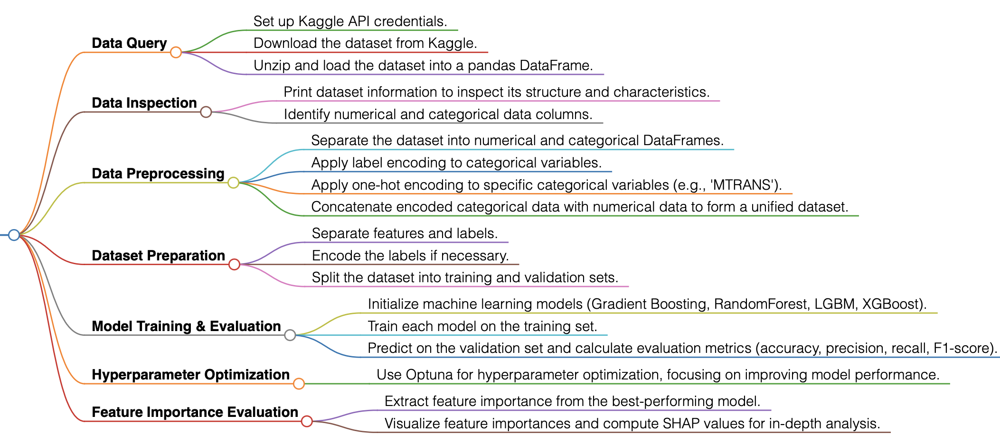
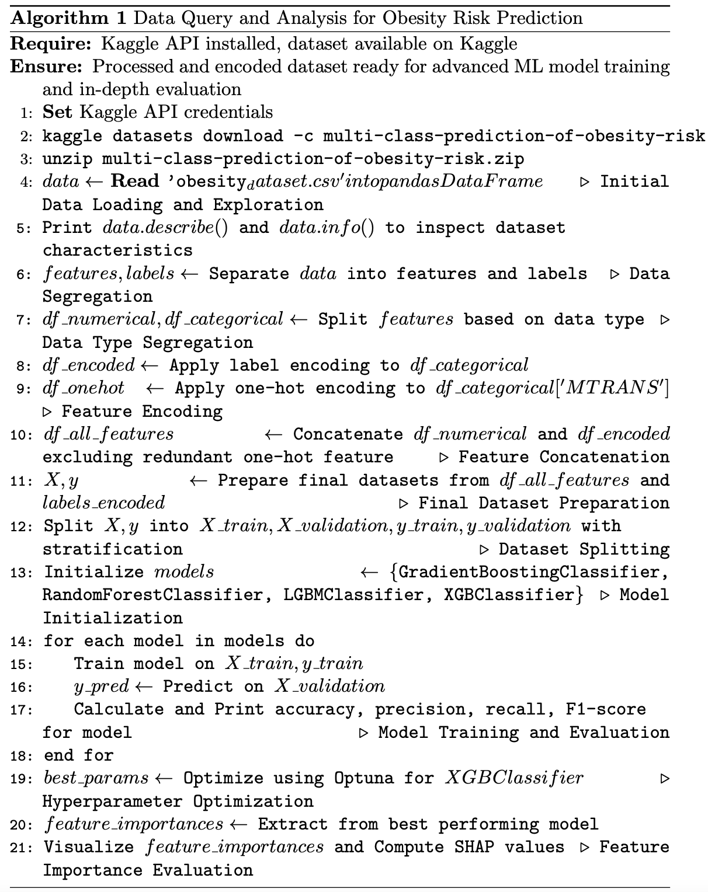

# Data Query and Analysis

## Data Query

### Overview
The methodology begins with the programmatic retrieval of the Multi-Class Prediction of Obesity Risk dataset from Kaggle. This dataset plays a pivotal role in forecasting obesity levels through various indicators, including dietary habits, physical activities, and genetic predispositions.

### Data Query Process

#### Preliminary Steps
- The process involves the installation of necessary libraries such as `pandas` for data manipulation, alongside the Kaggle API for dataset acquisition.
- It also requires setting up environment variables with Kaggle API credentials to facilitate secure access to the dataset.

#### Query Process
- Utilizing Kaggle API commands to download the dataset.
- The dataset is then extracted from its zip file and decompressed.
- It's loaded into a pandas DataFrame for preliminary exploration and processing.
- Initial steps for data inspection and preprocessing involve identifying missing values, understanding the data types, and conducting basic data cleaning.
- The cleaned dataset is saved in a suitable format (e.g., CSV) for subsequent analysis and model training phases.

### Rationale for Dataset Usage
The chosen dataset provides a comprehensive view of the factors influencing obesity, laying a strong foundation for predictive modeling. Its selection is motivated by its applicability to health informatics, offering valuable insights into obesity trends that could guide healthcare strategies and interventions.

## Data Analysis

### Preprocessing and Feature Engineering

#### Preprocessing Steps
- The data undergoes a series of preprocessing steps to prepare it for model training. This includes separating the dataset into numerical and categorical dataframes based on data types.
- Label encoding is applied to transform categorical variables like `Gender`, `family_history_with_overweight`, and others into numerical representations.
- One-hot encoding is utilized for the `MTRANS` variable to convert it into a binary vector representation.

#### Feature Engineering
- After encoding, redundant features are removed, and the one-hot encoded variables are concatenated with the rest of the dataset.
- The dataset is then merged back into a single dataframe that combines both numerical and encoded categorical features, ready for model training.

### Model Training and Evaluation

#### Model Training
- The dataset is split into training and validation sets to evaluate the model's performance on unseen data.
- A variety of machine learning models including Gradient Boosting Classifier, Random Forest Classifier, LightGBM, and XGBoost are trained on the dataset.
- Each model's hyperparameters are fine-tuned to optimize performance, employing techniques like cross-validation and Optuna for hyperparameter optimization.

#### Model Evaluation
- The models are evaluated based on accuracy, precision, recall, and F1-score to determine their effectiveness in predicting obesity levels.
- An additional layer of analysis is introduced by calculating feature importances and utilizing SHAP values to interpret the models, offering insights into the factors most influential in predicting obesity.

### Optimization and Insights

#### Hyperparameter Optimization
- Optuna is used for hyperparameter optimization, focusing on maximizing the accuracy of the XGBoost model. This involves experimenting with various configurations of hyperparameters like `max_depth`, `n_estimators`, and `learning_rate`.
- The optimization process aims to find the best model configuration that yields the highest validation accuracy.

#### Feature Importance and Model Interpretation
- The importance of different features in the predictive models is analyzed to identify the most significant predictors of obesity.
- SHAP values are computed for the XGBoost model to offer a deeper understanding of the model's decision-making process, highlighting how different features contribute to the model's predictions.

## Flowchart for Data Query & Data Analysis


## Reference
- Kaggle's Multi-Class Prediction of Obesity Risk Dataset. Accessed: [Obesity Risk Dataset](https://www.kaggle.com/competitions/playground-series-s4e2/data)

## Pseudo-Code



## Pseudo-Code for Data Query and Analysis Process

```latex
\begin{algorithm}
\caption{Enhanced Data Query and Analysis for Obesity Risk Prediction}
\label{alg:enhanced_obesity_pred}
\begin{algorithmic}[1]

\Require Kaggle API installed, dataset available on Kaggle
\Ensure Processed and encoded dataset ready for advanced ML model training and in-depth evaluation

\State \textbf{Set} Kaggle API credentials
\State \texttt{kaggle datasets download -c multi-class-prediction-of-obesity-risk}
\State \texttt{unzip multi-class-prediction-of-obesity-risk.zip}

\State $data \gets$ \textbf{Read} \texttt{'obesity_dataset.csv'} into pandas DataFrame
\Comment{Initial Data Loading and Exploration}
\State \textbf{Print} $data.describe()$ and $data.info()$ to inspect dataset characteristics

\State $features, labels \gets$ \textbf{Separate} $data$ into features and labels
\Comment{Data Segregation}
\State $df\_numerical, df\_categorical \gets$ \textbf{Split} $features$ based on data type
\Comment{Data Type Segregation}

\State $df\_encoded \gets$ \textbf{Apply} label encoding to $df\_categorical$
\State $df\_onehot \gets$ \textbf{Apply} one-hot encoding to $df\_categorical['MTRANS']$
\Comment{Feature Encoding}

\State $df\_all\_features \gets$ \textbf{Concatenate} $df\_numerical$ and $df\_encoded$ excluding redundant one-hot feature
\Comment{Feature Concatenation}

\State $X, y \gets$ \textbf{Prepare} final datasets from $df\_all\_features$ and $labels\_encoded$
\Comment{Final Dataset Preparation}

\State \textbf{Split} $X, y$ into $X\_train, X\_validation, y\_train, y\_validation$ with stratification
\Comment{Dataset Splitting}

\State Initialize $models \gets$ \{\texttt{GradientBoostingClassifier, RandomForestClassifier, LGBMClassifier, XGBClassifier}\}
\Comment{Model Initialization}

\For{\textbf{each} model in models}
    \State \textbf{Train} model on $X\_train, y\_train$
    \State $y\_pred \gets$ \textbf{Predict} on $X\_validation$
    \State Calculate and \textbf{Print} accuracy, precision, recall, F1-score for model
    \Comment{Model Training and Evaluation}
\EndFor

\State $best\_params \gets$ \textbf{Optimize} using Optuna for $XGBClassifier$
\Comment{Hyperparameter Optimization}

\State $feature\_importances \gets$ \textbf{Extract} from best performing model
\State \textbf{Visualize} $feature\_importances$ and \textbf{Compute} SHAP values
\Comment{Feature Importance Evaluation}

\end{algorithmic}
\end{algorithm}

