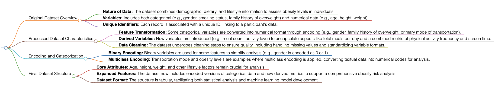

# Data Description

This dataset originates from the "Multi-Class Prediction of Obesity Risk" Kaggle competition. It aims to predict obesity levels based on demographic, dietary, and physical activity data. It is structured to enable the analysis of factors that contribute to obesity levels in individuals.

## Queried Data

The raw data captures various aspects of an individual's lifestyle and health status, which include:

- **Gender:** Participant's gender (Male/Female).
- **Age:** Participant's age.
- **Height:** Participant's height in meters.
- **Weight:** Participant's weight in kilograms.
- **Family History with Overweight:** Presence of overweight family history (Yes/No).
- **FAVC:** Frequent consumption of high caloric food (Yes/No).
- **FCVC:** Frequency of consumption of vegetables.
- **NCP:** Number of main meals.
- **CAEC:** Consumption of food between meals.
- **SMOKE:** Smoking status (Yes/No).
- **CH2O:** Daily water consumption in liters.
- **SCC:** Calorie consumption monitoring (Yes/No).
- **FAF:** Frequency of physical activity.
- **TUE:** Time using technology devices in hours.
- **CALC:** Consumption of alcohol.
- **MTRANS:** Main transportation mode.
- **NObeyesdad:** Obesity level category.

Sample row from the queried data:

| Gender | Age  | Height | Weight | Family History with Overweight | FAVC | FCVC | ... | MTRANS                 | NObeyesdad            |
|--------|------|--------|--------|--------------------------------|------|------|-----|------------------------|-----------------------|
| Male   | 24.4 | 1.70   | 81.7   | Yes                            | Yes  | 2.0  | ... | Public Transportation  | Overweight_Level_II   |
| Female | 18.0 | 1.56   | 57.0   | Yes                            | Yes  | 2.0  | ... | Automobile             | Normal_Weight         |

## Processed Data

The processed data transforms the above features into a more analysis-friendly format, with categorical data encoded and some new binary features introduced:

- **Age, Height, Weight, FCVC, NCP, CH2O, FAF, TUE:** Retained numerical features.
- **Gender:** Encoded as 0 (Male) and 1 (Female).
- **Family History with Overweight, FAVC, CAEC, SMOKE, SCC, CALC:** Encoded as binary variables.
- **Automobile, Bike, Motorbike, Public Transportation:** Transport mode encoded as binary variables.

Sample row from the processed data:

| Age  | Height | Weight | FCVC | NCP  | CH2O | FAF | TUE | Gender | Family History with Overweight | FAVC | CAEC | ... | Public Transportation |
|------|--------|--------|------|------|------|-----|-----|--------|--------------------------------|------|------|-----|------------------------|
| 24.4 | 1.70   | 81.7   | 2.0  | 3.0  | 2.76 | 0.0 | 0.98 | 0      | 1                              | 1    | 1    | ... | 1                      |
| 18.0 | 1.56   | 57.0   | 2.0  | 3.0  | 2.0  | 1.0 | 1.0  | 1      | 1                              | 1    | 2    | ... | 0                      |

# Flowchart of Dataset Structure


# Reference

- Multi-Class Prediction of Obesity Risk. Kaggle. [https://www.kaggle.com/competitions/playground-series-s4e2/data](https://www.kaggle.com/competitions/playground-series-s4e2/data).

```bibtex
@online{KaggleObesityRisk2023,
  title={Multi-Class Prediction of Obesity Risk},
  year={2023},
  url={https://www.kaggle.com/competitions/playground-series-s4e2/data}
}

