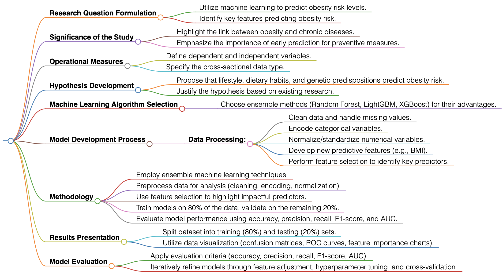

# 1.1. The Prediction Problem
## Research Question Formulation:
- How can machine learning models be effectively utilized to predict obesity risk levels based on a range of features?
- Which are the most important features used to predict obesity risk?

### Significance
Understanding and predicting obesity risk is crucial due to its association with several chronic diseases, such as diabetes, heart disease, and some cancers. Early prediction facilitates preventive measures and personalized healthcare interventions, reducing the overall healthcare burden.

## Operational Measures

### Variables
- **Dependent (Y) Variable:** Obesity Level (Categorical: from Insufficient Weight to Obesity Type III)
- **Independent (X) Variables:** Age, Gender, Height, Weight, Family History of Overweight, Food Consumption Habits, Physical Activity Level, Water Consumption, Screen Time, Transport Used, etc.
- **Data Type:** Cross-sectional, capturing individual information at a single point in time.

## Hypothesis Development
- **Prediction Hypothesis:** Lifestyle and dietary habits (e.g., high caloric food consumption, physical inactivity, low water intake), along with genetic predispositions (e.g., family history of overweight), are significant predictors of obesity risk level.
- **Justification:** This hypothesis draws on existing research identifying these factors as key contributors to obesity, providing quantifiable insights into obesity risk categories.
- **Machine Learning Algorithm Selection:** Ensemble methods like Random Forest, LightGBM, and XGBoost are selected for their robustness in handling diverse data types, managing overfitting, and leveraging multiple decision trees to enhance prediction accuracy.

# 1.2. The Machine Learning Workflow
## Model Development
### Data Processing
The methodology includes data cleaning, handling missing values, encoding categorical variables, normalizing/standardizing numerical variables, and developing new features (e.g., BMI) to enhance predictive capability. Feature selection identifies crucial predictors of obesity risk.

## Methodology
Our study employs ensemble machine learning techniques—Random Forest, LightGBM, and XGBoost—to predict obesity risk levels from a comprehensive dataset, including nutrition, physical activity, genetic predispositions, and lifestyle choices. The data undergo rigorous preprocessing, including cleaning, encoding, and normalization. Feature selection is critical to identifying key obesity risk predictors. Models are trained on 80% of the data and validated on the remaining 20%, using metrics like accuracy, precision, recall, F1-score, and AUC to evaluate performance and uncover the most predictive features.

## Results Presentation
### Training and Testing
The dataset is divided into an 80% training set and a 20% testing set to assess model performance.
### Data Visualization
We use confusion matrices, ROC curves, and feature importance charts to illustrate findings, effectively showcasing model performance and variable impacts on predictions.

## Model Evaluation
### Evaluation Criteria
Model performance is assessed through accuracy, precision, recall, F1-score, and AUC, providing a comprehensive view of predictive power.
### Iterative Improvement
Through iterative refinement—feature adjustment, hyperparameter tuning, and algorithm testing—and cross-validation, we enhance model accuracy and ensure robustness.

## Flowchart of Method 
 

## References
- Roblin, L. (2007). Childhood obesity: food, nutrient, and eating-habit trends and influences. *Applied Physiology, Nutrition, and Metabolism*, 32(4), 635-645.
- Marti, A., Moreno-Aliaga, M. J., Hebebrand, J., & Martinesz, J. A. (2004). Genes, lifestyles and obesity. *International Journal of Obesity*, 28(3), S29-S36.

