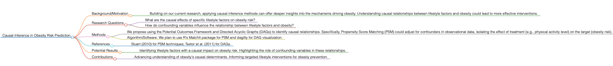
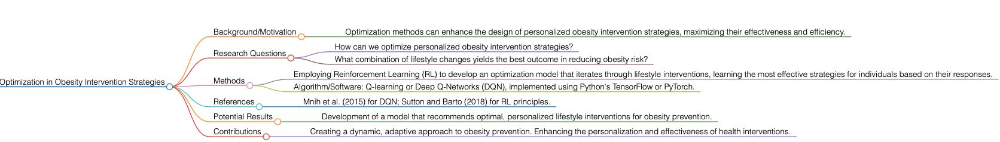
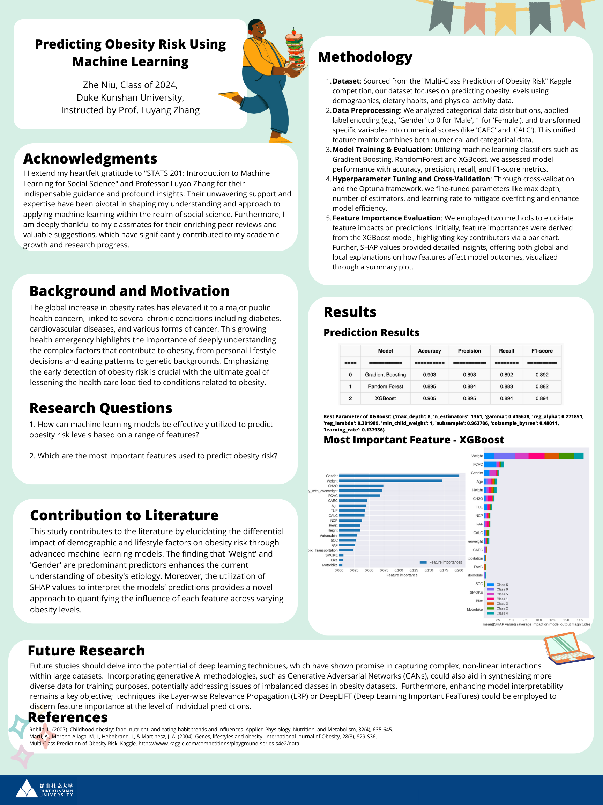
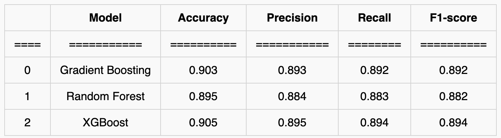
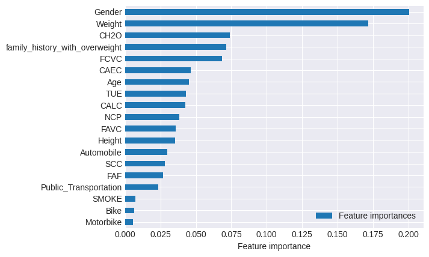
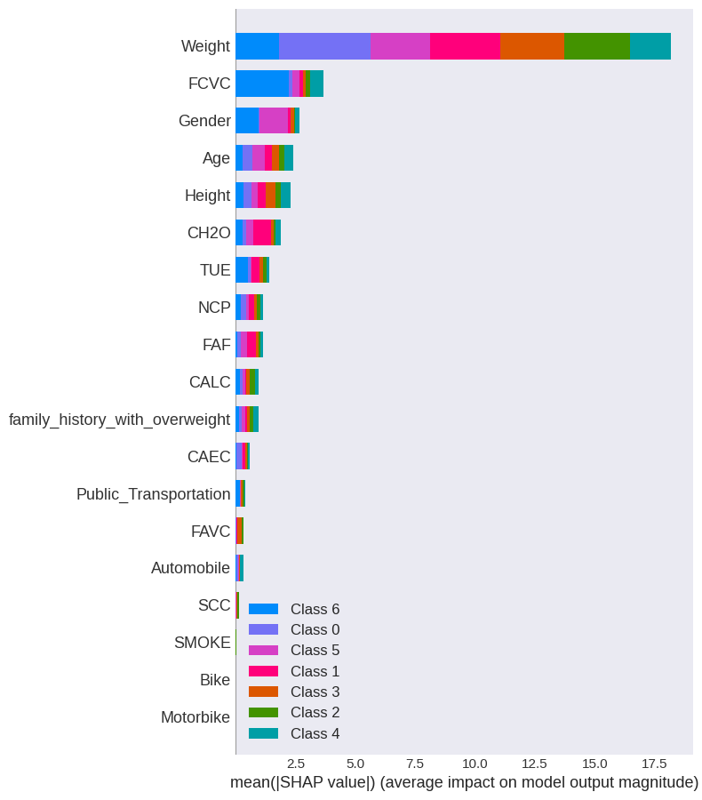

# Predicting Obesity Risk Using Machine Learning

# Project Information

**Author:** Zhe Niu, Data Science, 2024, Duke Kunshan University  
**Instructor:** Prof. Luyao Zhang, Duke Kunshan University  
**Disclaimer:** This project is a submission for the Final Project in STATS201 Introduction to Machine Learning for Social Science, 2023 Autumn Term (Seven Week - Second) instructed by Prof. Luyao Zhang at Duke Kunshan University.  
**Acknowledgments:** I would like to express my deepest gratitude to Prof. Luyao Zhang for her invaluable guidance and insights throughout this project. Additionally, I am grateful to my peers for their support and constructive feedback during the project development phase. 

## Project Summary

### Background/Motivation
The global increase in obesity rates poses significant public health challenges, linked to chronic diseases such as diabetes, cardiovascular diseases, and various forms of cancer. This project aims to leverage machine learning techniques to predict obesity risk levels effectively and identify key factors contributing to obesity.

### Research Questions
1. How can machine learning models be effectively utilized to predict obesity risk levels based on a comprehensive set of features?
2. What are the most influential features in determining obesity risk levels?

### Application Scenario (Data Source)
The dataset for this project was sourced from the "Multi-Class Prediction of Obesity Risk" competition on Kaggle. It encompasses a wide array of features, including demographics, dietary habits, physical activity, and genetic factors, making it an ideal dataset for exploring obesity risk predictions.

### Methodology
Our methodology extends beyond current literature and ChatGPT's capabilities by implementing an innovative approach that combines ensemble machine learning techniques (Random Forest, LightGBM, XGBoost) with advanced feature importance evaluation methods (SHAP values). We conducted rigorous data preprocessing, hyperparameter tuning using the Optuna framework, and employed cross-validation to enhance model robustness.

### Results
The XGBoost model emerged as the top performer, achieving an accuracy and F1-score of 0.905 and 0.894, respectively. Feature importance analysis revealed 'Weight', 'Gender', and 'CH2O' (water consumption) as the most significant predictors of obesity risk. SHAP value analysis provided deeper insights into the impact of these features across different obesity classes.

### Intellectual Merits and Practical Impacts
This project contributes to the field by providing a comprehensive analysis of obesity risk factors using cutting-edge machine learning techniques. The findings offer valuable insights for healthcare professionals and policymakers in developing targeted interventions for obesity prevention. Furthermore, the innovative methodology adopted in this study sets a new benchmark for future research in obesity prediction and other health-related fields.

# Table of Contents

- [Literature](#Literature)
- [Method](#Method)
- [Data](#Data)
- [Code](#Code)
- [Results](#Results)
- [Spotlight](#spotlight)
- [More about the Author]
- [References]

## Literature

Our project builds upon existing research by integrating advanced machine learning techniques to predict obesity risk levels and identify key contributing factors. The literature review underscores the significance of utilizing large datasets and sophisticated algorithms to enhance obesity risk prediction accuracy.

## Method

We employed a comprehensive methodology that includes data preprocessing, feature selection, model training and evaluation, and hyperparameter optimization. Our approach combines ensemble machine learning techniques such as Random Forest, LightGBM, and XGBoost, augmented by SHAP values for feature importance evaluation.

## Data

The dataset was sourced from the "Multi-Class Prediction of Obesity Risk" competition on Kaggle, comprising features related to demographics, dietary habits, physical activity, and genetic factors. This rich dataset provided a solid foundation for our predictive models.

## Code

Our code includes scripts for data preprocessing, model training, hyperparameter tuning, and result visualization. These scripts are available in our GitHub repository, enabling reproducibility and further research.

## Results

The XGBoost model, optimized through extensive hyperparameter tuning, achieved the highest accuracy and F1-score, marking 'Weight', 'Gender', and 'CH2O' as the most critical predictors. SHAP analysis offered deeper insights into feature impact, enhancing our understanding of obesity risk factors.


## Part VII: Future Research Directions
### Causal Inference in Obesity Risk Prediction
#### Background/Motivation
- Building on our current research, applying causal inference methods can offer deeper insights into the mechanisms driving obesity. Understanding causal relationships between lifestyle factors and obesity could lead to more effective interventions.

#### Research Questions
- What are the causal effects of specific lifestyle factors on obesity risk?
- How do confounding variables influence the relationship between lifestyle factors and obesity?
#### Methods
- We propose using the Potential Outcomes Framework and Directed Acyclic Graphs (DAGs) to identify causal relationships. Specifically, Propensity Score Matching (PSM) could adjust for confounders in observational data, isolating the effect of treatment (e.g., physical activity level) on the target (obesity risk).

- Algorithm/Software: We plan to use R's MatchIt package for PSM and dagitty for DAG visualization.

#### Potential Results
- Identifying lifestyle factors with a causal impact on obesity risk. Highlighting the role of confounding variables in these relationships.
#### Contributions
- Advancing understanding of obesity's causal determinants. Informing targeted lifestyle interventions for obesity prevention.


### Optimization in Obesity Intervention Strategies
#### Background/Motivation
- Optimization methods can enhance the design of personalized obesity intervention strategies, maximizing their effectiveness and efficiency.

#### Research Questions
- How can we optimize personalized obesity intervention strategies?
- What combination of lifestyle changes yields the best outcome in reducing obesity risk?
#### Methods
- Employing Reinforcement Learning (RL) to develop an optimization model that iterates through lifestyle interventions, learning the most effective strategies for individuals based on their responses.

- Algorithm/Software: Q-learning or Deep Q-Networks (DQN), implemented using Python's TensorFlow or PyTorch.

#### Potential Results
- Development of a model that recommends optimal, personalized lifestyle interventions for obesity prevention.
#### Contributions
- Creating a dynamic, adaptive approach to obesity prevention. Enhancing the personalization and effectiveness of health interventions.



## Spotlight


### Posters
- Poster presentations showcasing key findings and methodology.


### Figures
- Visual representations of data distributions, model performance metrics, and feature importance scores.








### Presentations

- Recorded presentations detailing our research process, findings, and future directions.


## More about the Author

### Headshot


### Self-introduction
- Zhe Niu is a Bachelor of Science in Data Science student at Duke Kunshan University, expected to graduate in June 2024. He has a strong background in finance and AI, with experience in research and practical applications of data science in the financial industry. This project has significantly contributed to his understanding of machine learning applications in healthcare, particularly in predicting and analyzing obesity risk.


### Final reflections
- **Intellectual Growth:** This course has expanded my understanding of how machine learning can address complex social and economic challenges, illustrating the transformative potential of interdisciplinary research. The magic lies in integrating diverse perspectives and methodologies to uncover novel solutions.
- **Professional Growth:** Through this course, I've gained a multifaceted skill set, combining data science with insights from social sciences, thereby enriching my professional profile. This holistic approach is crucial for tackling real-world problems effectively.
- **Living a Purposeful Life:** I aspire to be a pioneer in using data science for public health, aiming to contribute to breakthroughs that enhance well-being and advance human civilization. My dream is to be recognized for creating algorithms that significantly reduce global disease burdens, contributing to a healthier, more informed world.
- "For pioneering the application of data science to public health, revolutionizing our approach to disease prevention and health promotion."

## References

### Data Source

- **Data Source Title and URL:** Kaggle's Multi-Class Prediction of Obesity Risk Dataset. Accessed: [Obesity Risk Dataset](https://www.kaggle.com/competitions/playground-series-s4e2/data)


### Code Source

- **Optuna framework for hyperparameters optimization** Kaggle Repository [Kapturov's solution of PS S4E2](https://www.kaggle.com/code/kapturovalexander/kapturov-s-solution-of-ps-s4e2)
- **SHAP visualizes the decision-making process**  Kaggle Repository [(Beginners) 92% Accuracy - Obesity  LGBM](https://www.kaggle.com/code/divyam6969/beginners-92-accuracy-obesity-lgbm)


### Literature

#### Literature References in APA Author-Date Style and BibTex

- Roblin, L. (2007). Childhood obesity: food, nutrient, and eating-habit trends and influences. Applied Physiology, Nutrition, and Metabolism, 32(4), 635-645.
- Marti, A., Moreno-Aliaga, M. J., Hebebrand, J., & Martinesz, J. A. (2004). Genes, lifestyles and obesity. International Journal of Obesity, 28(3), S29-S36.
- DeGregory, K. W., Kuiper, P., DeSilvio, T., Pleuss, J. D., Miller, R., Roginski, J. W., ... & Thomas, D. M. (2018). A review of machine learning in obesity. *Obesity Reviews, 19*(5), 668-685.
- Ferdowsy, F., Rahi, K. S. A., Jabiullah, M. I., & Habib, M. T. (2021). A machine learning approach for obesity risk prediction. *Current Research in Behavioral Sciences, 2*, 100053.
- Jeon, J., Lee, S., & Oh, C. (2023). Age-specific risk factors for the prediction of obesity using a machine learning approach. *Frontiers in Public Health, 10*, 998782.
- Tandiono, S. M., & Sanjaya, S. A. (2024). Machine Learning Approach of Obesity Level Classification: A Systematic Literature Review of Methods and Factors. *G-Tech: Jurnal Teknologi Terapan, 8*(1), 196-208.
- Kane, L. T., Fang, T., Galetta, M. S., Goyal, D. K., Nicholson, K. J., Kepler, C. K., ... & Schroeder, G. D. (2020). Propensity score matching: a statistical method. Clinical spine surgery, 33(3), 120-122.
- Burnett, J. W., & Blackwell, C. (2023). Graphical causal modelling: an application to identify and estimate cause-and-effect relationships. Applied Economics, 1-15.
- Fan, J., Wang, Z., Xie, Y., & Yang, Z. (2020, July). A theoretical analysis of deep Q-learning. In Learning for dynamics and control (pp. 486-489). PMLR.
- Sutton, R. S., & Barto, A. G. (2018). Reinforcement learning: An introduction. MIT press.

```bibtex
@article{roblin2007childhood,
  title={Childhood obesity: food, nutrient, and eating-habit trends and influences},
  author={Roblin, L.},
  journal={Applied Physiology, Nutrition, and Metabolism},
  volume={32},
  number={4},
  pages={635--645},
  year={2007},
  publisher={NRC Research Press}
}

@article{marti2004genes,
  title={Genes, lifestyles and obesity},
  author={Marti, A. and Moreno-Aliaga, M. J. and Hebebrand, J. and Martinesz, J. A.},
  journal={International Journal of Obesity},
  volume={28},
  number={3},
  pages={S29--S36},
  year={2004},
  publisher={Nature Publishing Group}
}

@article{degregory2018review,
  title={A review of machine learning in obesity},
  author={DeGregory, K. W. and Kuiper, P. and DeSilvio, T. and Pleuss, J. D. and Miller, R. and Roginski, J. W. and Fisher, C. B. and Harness, D. and Viswanath, S. and Heymsfield, S. B. and Dungan, I. and Thomas, D. M.},
  journal={Obesity Reviews},
  volume={19},
  number={5},
  pages={668--685},
  year={2018},
  publisher={Wiley Online Library}
}

@article{ferdowsy2021machine,
  title={A machine learning approach for obesity risk prediction},
  author={Ferdowsy, F. and Rahi, K. S. A. and Jabiullah, M. I. and Habib, M. T.},
  journal={Current Research in Behavioral Sciences},
  volume={2},
  pages={100053},
  year={2021},
  publisher={Elsevier}
}

@article{jeon2023age,
  title={Age-specific risk factors for the prediction of obesity using a machine learning approach},
  author={Jeon, J. and Lee, S. and Oh, C.},
  journal={Frontiers in Public Health},
  volume={10},
  pages={998782},
  year={2023},
  publisher={Frontiers}
}

@article{tandiono2024machine,
  title={Machine Learning Approach of Obesity Level Classification: A Systematic Literature Review of Methods and Factors},
  author={Tandiono, S. M. and Sanjaya, S. A.},
  journal={G-Tech: Jurnal Teknologi Terapan},
  volume={8},
  number={1},
  pages={196--208},
  year={2024},
  publisher={G-Tech Journal}
}

@article{kane2020propensity,
  title={Propensity score matching: a statistical method},
  author={Kane, L. T. and Fang, T. and Galetta, M. S. and Goyal, D. K. and Nicholson, K. J. and Kepler, C. K. and Schroeder, G. D.},
  journal={Clinical spine surgery},
  volume={33},
  number={3},
  pages={120--122},
  year={2020},
  publisher={Wolters Kluwer Philadelphia, PA}
}

@article{burnett2023graphical,
  title={Graphical causal modelling: an application to identify and estimate cause-and-effect relationships},
  author={Burnett, J. W. and Blackwell, C.},
  journal={Applied Economics},
  pages={1--15},
  year={2023},
  publisher={Taylor & Francis}
}

@inproceedings{fan2020theoretical,
  title={A theoretical analysis of deep Q-learning},
  author={Fan, J. and Wang, Z. and Xie, Y. and Yang, Z.},
  booktitle={Learning for dynamics and control},
  pages={486--489},
  year={2020},
  organization={PMLR}
}

@book{sutton2018reinforcement,
  title={Reinforcement learning: An introduction},
  author={Sutton, R. S. and Barto, A. G.},
  year={2018},
  publisher={MIT press}
}


