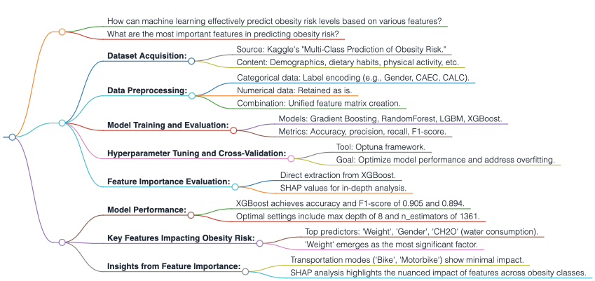

## Results
- Our methodology, integrating advanced machine learning models and comprehensive data preprocessing techniques, has yielded insightful results in predicting obesity risk levels from the Kaggle competition dataset "Multi-Class Prediction of Obesity Risk." The dataset's diverse range of features, including demographics, dietary habits, and physical activity, underwent rigorous preprocessing to ensure a robust analysis foundation.

### **Model Performance:**
- The XGBoost model emerged as a top performer, achieving impressive accuracy and F1-score metrics of 0.905 and 0.894, respectively. These results underscore the model's precision in identifying varying levels of obesity risk, demonstrating the effectiveness of our feature engineering and model training strategies. The optimal model configuration, achieved through meticulous hyperparameter tuning via the Optuna framework, included a max depth of 8 and n_estimators of 1361, among other parameters. This fine-tuning process was crucial in enhancing the model's ability to navigate the dataset's complexity efficiently.

### **Feature Importance Insights:**
- A critical aspect of our analysis was the evaluation of feature importance, which provided a deeper understanding of the factors influencing obesity risk predictions. Notably, 'Weight', 'Gender', and 'CH2O' (water consumption) were identified as the most influential features, with 'Weight' being the predominant predictor. This finding highlights the direct relationship between body weight and obesity risk, aligning with existing health research. 

- Visualization of feature importance scores revealed 'Gender' as a significant predictor, closely followed by 'Weight', indicating their pivotal roles in the model's predictive accuracy. Conversely, transportation modes such as 'Bike' and 'Motorbike' showed minimal impact on the model's outcomes, suggesting these factors play a lesser role in obesity risk assessment.

### **Deep Dive with SHAP Values:**
- Employing SHAP (SHapley Additive exPlanations) allowed us to further dissect the model's decision-making process, offering both global and local insights into feature impact. The SHAP summary plot underscored 'Weight's' critical role across all obesity classes, with each color in the plot representing a different class and illustrating the variable impacts of features like 'FCVC' (Frequency of high caloric vegetable consumption) on obesity risk prediction.

### **Summary:**

In summary, our study not only validated the predictive power of machine learning in assessing obesity risk but also illuminated the key drivers behind obesity predictions. Through advanced modeling, hyperparameter optimization, and innovative feature importance evaluation, we have contributed valuable insights into the complex interplay of factors influencing obesity risk.

### **Flowchart of Results:**

